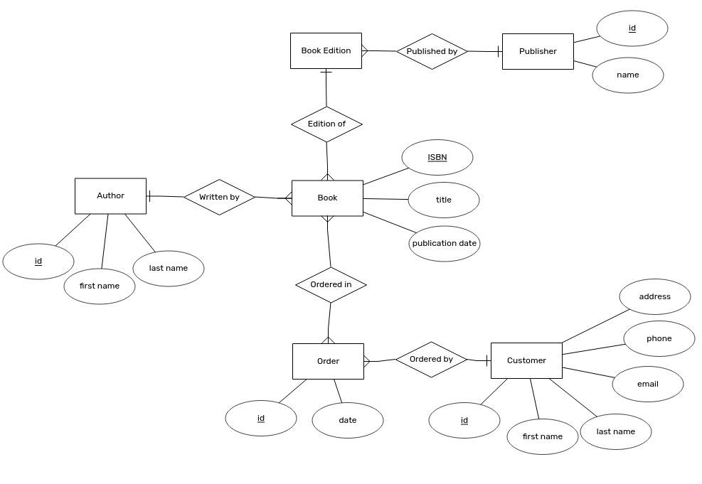
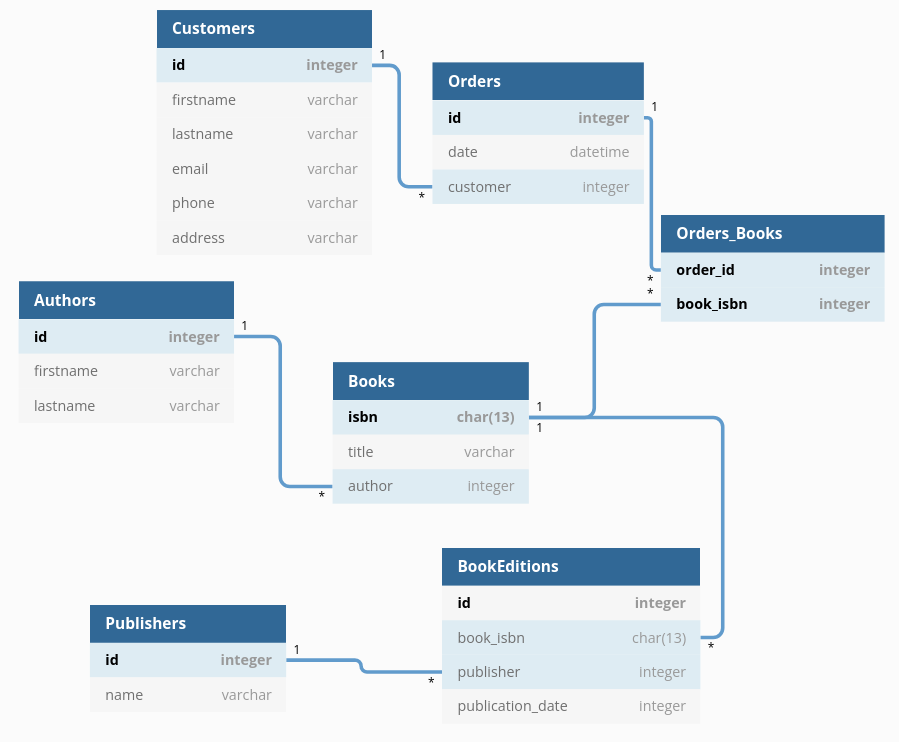

# Online könyvesbolt adatbázis

## ER diagram



## Relációs modell



## SQL a táblák létrehozásához

```sql
CREATE TABLE `Authors` (
  `id` integer,
  `firstname` varchar(255) NOT NULL,
  `lastname` varchar(255) NOT NULL,
  CONSTRAINT PK_Author PRIMARY KEY (`id`)
);

CREATE TABLE `Books` (
  `isbn` char(13),
  `title` varchar(255) NOT NULL,
  `author` integer NOT NULL,
  CONSTRAINT PK_Book PRIMARY KEY (`isbn`),
  CONSTRAINT FK_BookAuthor FOREIGN KEY (`author`)
  REFERENCES Authors(`id`),

);

CREATE TABLE `BookEditions` (
  `id` integer,
  `book_isbn` char(13),
  `publisher` integer NOT NULL,
  `publication_date` integer NOT NULL,
  CONSTRAINT PK_BookEdition PRIMARY KEY (`id`),
  CONSTRAINT FK_BookEditionPublisher FOREIGN KEY (`publisher`)
  REFERENCES Publishers(`id`)
);

CREATE TABLE `Publishers` (
  `id` integer,
  `name` varchar(255) NOT NULL,
  CONSTRAINT PK_Publisher PRIMARY KEY (`id`)
);

CREATE TABLE `Customers` (
  `id` integer,
  `firstname` varchar(255) NOT NULL,
  `lastname` varchar(255) NOT NULL,
  `email` varchar(255) NOT NULL,
  `phone` varchar(255),
  `address` varchar(255) NOT NULL,
  CONSTRAINT PK_Customer PRIMARY KEY (`id`)
);

CREATE TABLE `Orders` (
  `id` integer,
  `date` datetime NOT NULL,
  `customer` integer NOT NULL,
  CONSTRAINT PK_Order PRIMARY KEY (`id`),
  CONSTRAINT FK_OrderCustomer FOREIGN KEY (`customer`)
  REFERENCES Customers(`id`)
);

CREATE TABLE `Orders_Books` (
  `order_id` integer,
  `book_isbn` integer,
  CONSTRAINT PK_Order_Book PRIMARY KEY (`order_id`, `book_isbn`),
  CONSTRAINT FK_OrderBookOrder FOREIGN KEY (`order_id`)
  REFERENCES Orders(`id`),
  CONSTRAINT FK_OrderBookBook FOREIGN KEY (`book_id`)
  REFERENCES Books(`id`)
);

```