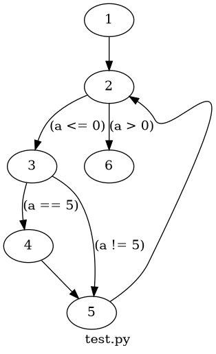

# Forráskód felgolgozás, elemzés, metrikák

## Control Flow Graph



### Megjegyzés

A számozott csomópontokhoz módosítottam a `staticfg` csomag `model` nevű modulját, az alábbi módon:

1. A `CFG` osztály konstruktorában létrehoztam egy számláló mezőt:

```python
def __init__(self, name, asynchr=False):
        assert type(name) == str, "Name of a CFG must be a string"
        assert type(asynchr) == bool, "Async must be a boolean value"
        # Name of the function or module being represented.
        self.name = name
        # Type of function represented by the CFG (sync or async). A Python
        # program is considered as a synchronous function (main).
        self.asynchr = asynchr
        # Entry block of the CFG.
        self.entryblock = None
        # Final blocks of the CFG.
        self.finalblocks = []
        # Sub-CFGs for functions defined inside the current CFG.
        self.functioncfgs = {}
        # Számláló a diagramhoz
        self.block_count = 0
```

2. A `_visit_blocks` metódusban átírtam a csomópontokra kerülő címke szövegét a számlálóra.

```python
    def _visit_blocks(self, graph, block, visited=[], calls=True):
        # Don't visit blocks twice.
        if block.id in visited:
            return

        #nodelabel = block.get_source()   # eredeti kód
        self.block_count += 1             # megnövelem a számlálót
        nodelabel = str(self.block_count) # beállítom a címkét a számlálóra

        graph.node(str(block.id), label=nodelabel)
        visited.append(block.id)

        # A függvényhívások megjelenítését kivettem megjegyzésbe.

        # Show the block's function calls in a node.
        # if calls and block.func_calls:
        #     calls_node = str(block.id)+"_calls"
        #     calls_label = block.get_calls().strip()
        #     graph.node(calls_node, label=calls_label,
        #                _attributes={'shape': 'box'})
        #     graph.edge(str(block.id), calls_node, label="calls",
        #                _attributes={'style': 'dashed'})

        # Recursively visit all the blocks of the CFG.
        for exit in block.exits:
            self._visit_blocks(graph, exit.target, visited, calls=calls)
            edgelabel = exit.get_exitcase().strip()
            graph.edge(str(block.id), str(exit.target.id), label=edgelabel)
```

Így a blokk teljes forráskódja helyett csak egy sorszámmal jelzi az adott blokkot. A módosított modul forráskódját bemásoltam az aktuális könyvtárba, így a futtatáshoz csak az alábbi csomagokat kell telepíteni:
- `graphviz`
- `ast`
- `astor`
- `radon`